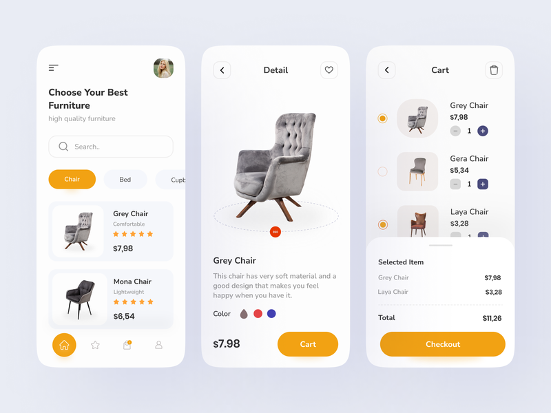

# Furniture App UI Kit 👋


[](#)

a Furniture app ui built with Flutter

# Flutter Version
Flutter 1.22.4


# 💻 Requirements

- Any Operating System (ie. MacOS X, Linux, Windows)
- Any IDE with Flutter SDK installed (ie. IntelliJ, Android Studio, VSCode etc)
- A little knowledge of Dart and Flutter

# Screenshots

||||
|--|--|--|
| 

# Command
### Install dependencies

```sh
flutter pub get
```

### Run application

```sh
flutter emulators --launch <emulator_name>
flutter run
```

### Build

```sh
flutter build apk
```

# Plugins

- [flutter_screenutil](https://pub.dev/packages/flutter_screenutil) 
- [convex_bottom_bar](https://pub.dev/packages/convex_bottom_bar) 

## Author

👤 **Flutter BoyFriend**

* Github: [@FlutterBoyfriend](https://github.com/FlutterBoyfriend)

## Show your support

Give a ⭐️ if you like this project!
